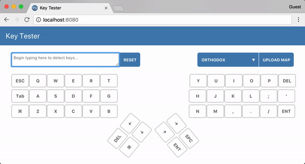

# Key Tester

Keyboard tester with keymap upload capability.
Improved with new functions and more layouts.



## Development Setup

``` bash

# Install the project's dependencies
npm install

# Serve with hot reload at localhost:8080
npm run serve

# Production build
npm run build

# Run all tests
npm test
```
